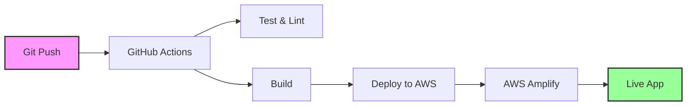

# 🚀 SplitBill CI/CD Pipeline

This document explains how to set up and use the automated CI/CD pipeline for the SplitBill application.

## 📋 Overview

The pipeline automatically:
- ✅ Runs tests and linting on every push/PR
- ✅ Builds the application
- ✅ Deploys to AWS Amplify on main branch
- ✅ Provides deployment status and notifications

## 🏗️ Pipeline Architecture



## 🛠️ Setup Instructions

### 1. Prerequisites

- AWS CLI installed and configured
- GitHub repository with your code
- Node.js 18+ (handled by pipeline)

### 2. Run the Setup Script

```bash
# Make sure you're in the project root
cd /Users/jairosp/code/SplitBill

# Run the automated setup
./scripts/setup-pipeline.sh
```

This script will:
- ✅ Verify AWS CLI configuration
- ✅ Create IAM user for GitHub Actions
- ✅ Generate AWS access keys
- ✅ Create necessary IAM policies
- ✅ Provide you with the secrets to add to GitHub

### 3. Add GitHub Secrets

After running the setup script, you'll get AWS credentials. Add them to your GitHub repository:

1. Go to your repository on GitHub
2. Click **Settings** → **Secrets and variables** → **Actions**
3. Click **New repository secret**
4. Add these secrets:
   - `AWS_ACCESS_KEY_ID` - The access key from the setup script
   - `AWS_SECRET_ACCESS_KEY` - The secret key from the setup script

### 4. Push Your Code

```bash
git add .
git commit -m "Add CI/CD pipeline"
git push origin main
```

## 🔄 Pipeline Workflow

### On Every Push/PR:
1. **Test & Lint Job**
   - Installs dependencies
   - Runs ESLint
   - Performs TypeScript type checking
   - Builds the application
   - Uploads build artifacts

### On Main Branch Only:
2. **Deploy Job**
   - Builds the application
   - Creates deployment package
   - Uploads to S3
   - Deploys to AWS Amplify
   - Waits for deployment completion
   - Cleans up temporary files
   - Provides deployment summary

## 📁 Pipeline Files

| File | Purpose |
|------|---------|
| `.github/workflows/ci-cd-pipeline.yml` | Main pipeline configuration |
| `.github/workflows/deploy.yml` | Simple deployment workflow |
| `scripts/setup-pipeline.sh` | Automated setup script |
| `PIPELINE.md` | This documentation |

## 🌐 Deployment URLs

- **Production:** https://main.didmk15yr2oa3.amplifyapp.com
- **AWS Console:** https://us-east-1.console.aws.amazon.com/amplify/apps/didmk15yr2oa3/overview

## 🔧 Customization

### Environment Variables

You can customize the pipeline by modifying these environment variables in `.github/workflows/ci-cd-pipeline.yml`:

```yaml
env:
  AWS_REGION: us-east-1
  AMPLIFY_APP_ID: didmk15yr2oa3
  AMPLIFY_BRANCH: main
  S3_BUCKET: splitbill-deployments
```

### Adding More Tests

To add more testing steps, modify the `test` job in the workflow:

```yaml
- name: Run custom tests
  run: npm run test:custom
```

### Deployment Branches

To deploy from different branches, modify the `if` condition in the deploy job:

```yaml
if: github.ref == 'refs/heads/main' || github.ref == 'refs/heads/production'
```

## 📊 Monitoring

### GitHub Actions
- View pipeline runs: **Actions** tab in your GitHub repository
- Check logs for each step
- Monitor deployment status

### AWS Amplify
- View deployment history in AWS Console
- Monitor build logs
- Check application performance

## 🚨 Troubleshooting

### Common Issues

1. **AWS Credentials Error**
   - Verify secrets are correctly set in GitHub
   - Check IAM permissions for the GitHub Actions user

2. **Build Failures**
   - Check the build logs in GitHub Actions
   - Verify all dependencies are in `package.json`

3. **Deployment Failures**
   - Check AWS Amplify console for detailed logs
   - Verify S3 bucket permissions

### Getting Help

1. Check GitHub Actions logs for detailed error messages
2. Review AWS CloudWatch logs for Amplify
3. Verify IAM permissions using AWS CLI

## 🔒 Security

The pipeline uses:
- ✅ Least-privilege IAM policies
- ✅ GitHub secrets for sensitive data
- ✅ Temporary AWS credentials
- ✅ Automatic cleanup of deployment artifacts

## 📈 Performance

The pipeline is optimized for:
- ⚡ Fast builds with npm caching
- 🎯 Parallel job execution
- 🧹 Automatic cleanup
- 📦 Efficient artifact management

---

**Need help?** Check the GitHub Actions logs or AWS Amplify console for detailed information about any issues.


