# 🎉 Split Bill App - Now Live on AWS!

**Congratulations!** Your Split Bill application is now running on AWS, powered by the scalability and reliability of the world's most comprehensive cloud platform.

## 🌐 Your Application is Live

**Production URL:** https://main.d28azgpy73fyaz.amplifyapp.com

*Your app is now accessible to users worldwide with lightning-fast performance thanks to AWS's global infrastructure.*

## ⚡ What AWS Amplify Delivers

✅ **Global Scale** - Your app is distributed across AWS's global edge locations  
✅ **Zero Downtime** - Built-in redundancy ensures 99.95% availability  
✅ **Lightning Fast** - Content delivered from the nearest edge location to your users  
✅ **Secure by Default** - HTTPS encryption and AWS security best practices  
✅ **Auto-Scaling** - Handles traffic spikes automatically  

## 🛠️ Manage Your Deployment

**AWS Console:** [Manage your Amplify app](https://us-east-1.console.aws.amazon.com/amplify/apps/d28azgpy73fyaz/overview)

*Monitor performance, view logs, configure custom domains, and manage deployments directly from the AWS Console.*

## 🏗️ Deployment Architecture

*The diagram shows key components of your deployment architecture.*

```mermaid
architecture-beta
    group aws(cloud)[AWS Cloud]
    
    service developer(person)[Developer]
    service amplify(server)[AWS Amplify] in aws
    service s3(storage)[S3 Bucket for Static Assets] in aws  
    service cloudfront(cdn)[CloudFront for Global CDN] in aws
    service users(person)[End Users]


    developer:R --> L:amplify
    amplify:R --> L:s3
    s3:R --> L:cloudfront
    cloudfront:R --> L:users
```

## 📋 Deployment Details

| Resource | Value |
|----------|-------|
| **App ARN** | `arn:aws:amplify:us-east-1:625164594347:apps/d28azgpy73fyaz` |
| **S3 Bucket** | `split-bill-deployments` |
| **Region** | `us-east-1` |
| **CDN** | Amazon CloudFront |

---

