# 🎉 Split Bill App - Production CI/CD Pipeline Live!

**Congratulations!** Your Split Bill application is now running on AWS with a complete CI/CD pipeline, powered by AWS Amplify, CodePipeline, and CodeBuild for professional team collaboration.

## 🌐 Your Production Application

**Production URL:** https://main.d1v3eupyvid3pc.amplifyapp.com

*Your app is now accessible to customers worldwide with automated deployments and enterprise-grade infrastructure.*

## 🔄 CI/CD Pipeline Overview

Your Split Bill application uses a complete CI/CD pipeline that automatically builds and deploys whenever you or your team push changes to the main branch.

## ⚡ What AWS Amplify Delivers

✅ **Global Scale** - Your app is distributed across AWS's global edge locations  
✅ **Zero Downtime** - Built-in redundancy ensures 99.95% availability  
✅ **Lightning Fast** - Content delivered from the nearest edge location to your users  
✅ **Secure by Default** - HTTPS encryption and AWS security best practices  
✅ **Auto-Scaling** - Handles traffic spikes automatically  

## 🛠️ Manage Your Deployment

**AWS Console:** [Manage your Amplify app](https://us-east-1.console.aws.amazon.com/amplify/apps/d2xomsdj7ybsc6/overview)

*Monitor performance, view logs, configure custom domains, and manage deployments directly from the AWS Console.*

## 🏗️ CI/CD Pipeline Architecture

```mermaid
graph LR
    A[👥 Team Push to GitHub] --> B[📦 CodePipeline Source]
    B --> C[🔨 CodeBuild Project]
    C --> D[🚀 AWS Amplify Deploy]
    D --> E[🌐 CloudFront CDN]
    E --> F[👥 Global Customers]
    
    style A fill:#e1f5fe
    style F fill:#e8f5e8
    style D fill:#fff3e0
```

## 🛠️ Team Workflow

1. **Developer pushes code** to main branch
2. **CodePipeline automatically triggers** build process  
3. **CodeBuild runs** `npm ci` and `npm run build`
4. **Amplify deploys** the built application
5. **Customers get updates** automatically via CloudFront

## 📋 Production Infrastructure Details

| Resource | Value |
|----------|-------|
| **Production App ARN** | `arn:aws:amplify:us-east-1:376058330285:apps/d1v3eupyvid3pc` |
| **CodePipeline** | `split-bill-production-pipeline` |
| **CodeBuild Project** | `split-bill-production-build` |
| **GitHub Repository** | `https://github.com/BillBalancer/SplitBill.git` |
| **Branch** | `main` |
| **Region** | `us-east-1` |
| **CDN** | Amazon CloudFront |

## 🎯 For Your Team

**AWS Console Management:** [Manage Pipeline](https://us-east-1.console.aws.amazon.com/amplify/apps/d1v3eupyvid3pc/overview)

- Monitor deployments and build logs
- View performance metrics and customer usage
- Configure custom domains for your brand
- Set up environment variables and secrets

---

